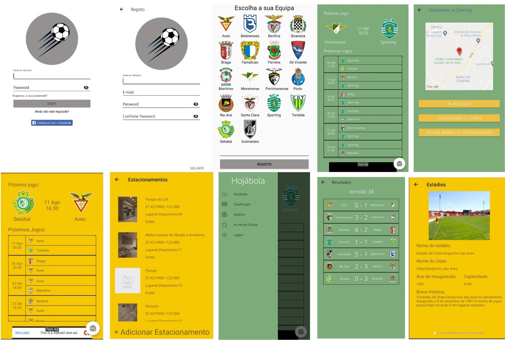

# Hojabola

Software system developed to complete the Bachelor degree in Computer Science. It shows informations about the fixtures, the standings and the stadiums from the portuguese Primeira Liga teams. Furthermore, it allow users to know how to get to the stadiums, where to park and where to eat, by other users suggestion.

## 1. Mobile App

*  **Android Project** - ['android_app/'](https://github.com/joselamar/Hojabola/tree/main/android_app)

        it contais all of the files an

*  [**'Hojabola.apk'**](https://github.com/joselamar/Hojabola/blob/main/Hojabola.apk)

        is the built application from the android project and it can be installed by trusting unknown sources.

## 2. Backend

* **API** - ['php/projectapi'](https://github.com/joselamar/Hojabola/tree/main/php/projectapi)

        contais the interface to connect the mobile application to the server. 

* **Web interface** - ['php/'](https://github.com/joselamar/Hojabola/tree/main/php)

        contais the administrator web interface where an authenticade user can review and manage all the data uploaded by users.

* **Database** - ['database/'](https://github.com/joselamar/Hojabola/tree/main/database)

        contains the entity relationship model, the script to create the database and scripts to populate database.

### 3. Report

* [**'Relatorio_Projeto_Final_Jose_Lamarao.pdf'**](https://github.com/joselamar/Hojabola/blob/main/Relatorio_Projeto_Final_Jose_Lamarao.pdf)

        is the final report done in the scope of the project it contais  technologies used, related works, software engineering, some of the implementation, business model and tests.  

## Screenshots

